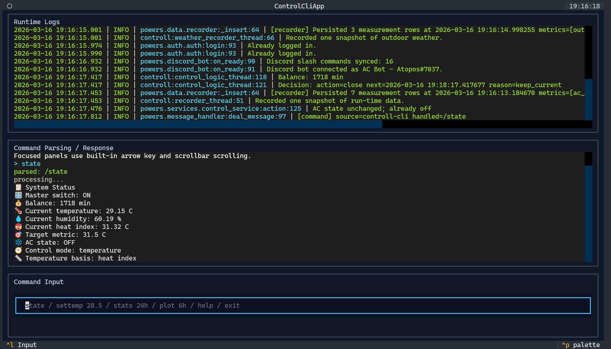
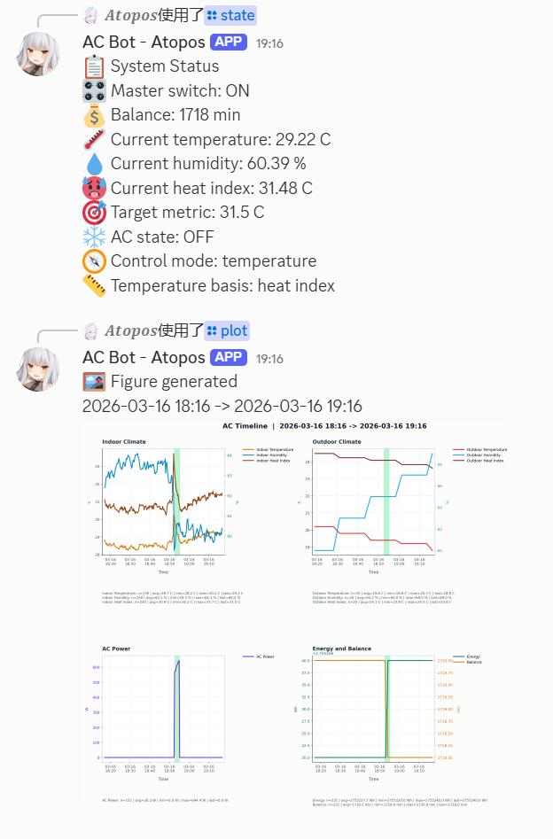

# HKUST AC Remaster

HKUST AC Remaster is an automated controller for a HKUST dorm air-conditioner. It logs into the campus prepaid AC portal, reads indoor climate data, applies either temperature-based or scheduler-based control, records time-series history, and exposes QQ, Discord, and local CLI control surfaces.

## Features

- HKUST login through Playwright with Microsoft TOTP
- Indoor climate polling through a pluggable thermometer module
- Temperature mode and scheduler mode control logic
- SQLite history recording, statistics, and figure export
- QQ bot, Discord bot, and local Textual CLI interfaces

## Screenshots

### `controll_cli.py` Interface



### `analyse.py` Output


### Bot Command Demo



## Project Layout

```text
controll.py        Main runtime entry point
run_forever.py      Auto-restart wrapper for long-running deployments
controll_cli.py    Local Textual control console
analyse.py          Analysis CLI / shell
powers/
  auth/             HKUST login and AC portal API client
  data/             State, settings, recorder, and analysis
  io/               Indoor sensor drivers
  services/         Control logic
  qq_bot.py         QQ bot integration
  discord_bot.py    Discord bot integration
  utils/            Config and logging
docs/               Chinese / English setup guides
```

## Requirements

- Python 3.10+
- Windows, Linux, or macOS
- Access to the HKUST AC portal network path
- An available Microsoft Authenticator-compatible TOTP app
- `playwright install chromium` completed on the target machine
- Optional: a local temperature / humidity driver if you want real indoor sensor readings
- Optional: QQ bot and Discord bot developer credentials

Notes:

- The project is not Windows-only.
- The included `start.bat` and `debug.bat` are convenience scripts for Windows users only.
- If your custom thermometer implementation talks to serial, USB, GPIO, or BLE hardware, the exact OS/device requirements depend on that implementation, not on the controller itself.

## Install

```bash
pip install -r requirements.txt
playwright install chromium
```

## Credentials

The program checks these files in order:

- `creds.json`
- `creds/credentials.json`

Start from the template:

```bash
cp creds/credentials.example.json creds/credentials.json
```

Windows PowerShell:

```powershell
Copy-Item creds/credentials.example.json creds/credentials.json
```

Template:

```json
{
  "email": "yourname@connect.ust.hk",
  "password": "your_password_here",
  "microsoft_secret": "BASE32_SECRET_FROM_MICROSOFT_AUTHENTICATOR",
  "qq_app_id": "your_qq_app_id",
  "qq_secret": "your_qq_secret",
  "discord_token": "your_discord_bot_token",
  "command_language": "zh"
}
```

## Run

Recommended long-running entry point:

```bash
python run_forever.py
```

This wrapper launches `controll_cli.py`, waits for it to exit, then starts it again after a delay. That is useful when the main process exits due to transient login, network, bot, or runtime failures.

Useful options:

```bash
python run_forever.py --delay 10
python run_forever.py --max-restarts 3
python run_forever.py -- python controll.py
```

Direct one-shot runtime:

```bash
python controll.py
```

Local control console:

```bash
python controll_cli.py
```

Analysis shell:

```bash
python analyse.py
```

## Bot Enable / Disable Switches

At the top of `controll.py`, there are two direct runtime toggles:

```python
ENABLE_QQ_BOT = True
ENABLE_DISCORD_BOT = True
```

## Sensor Behavior

The project ships with a built-in default temperature/humidity sensor module. It returns fixed values so the controller can run without any physical hardware.

The thermometer path is split into:

- abstract interface: `powers/io/thermometer.py`
- default fallback implementation: `powers/io/default_thermometer.py`
- local private override example: `powers/io/local_thermometer.example.py`

If you want live readings, create `powers/io/local_thermometer.py` and implement the `Thermometer` interface. The project will automatically prefer it over the default fallback.

## Detailed Strategy

The detailed control strategy and runtime behavior explanation is available here:

- [docs/control-strategy.en.md](docs/control-strategy.en.md)

## Shared Commands

QQ, Discord, and the local CLI all route into the same command handler. Common commands:

- `/state`
- `/scheduler`
- `/timer`
- `/lock`
- `/log`
- `/stats <range>`
- `/plot <range>`
- `/settemp <temperature>`
- `/setbasis <temperature|heatindex>`
- `/settime <on_seconds> <off_seconds>`
- `/setmode <temperature|scheduler>`
- `/switchOn`
- `/switchOff`

## Runtime Outputs

- `data/settings.json`: persisted runtime settings
- `data/ac_history.sqlite`: measurement database
- `figure/`: exported figures
- `log/`: runtime logs

## Security

- Never commit `creds.json`, `creds/credentials.json`, or any real secrets under `creds/`.
- `data/`, `log/`, and `figure/` are runtime artifacts and are git-ignored by default.

## Guides

- Chinese setup guide: [docs/setup.zh-CN.md](docs/setup.zh-CN.md)
- English setup guide: [docs/setup.en.md](docs/setup.en.md)
- Detailed control strategy: [docs/control-strategy.en.md](docs/control-strategy.en.md)
