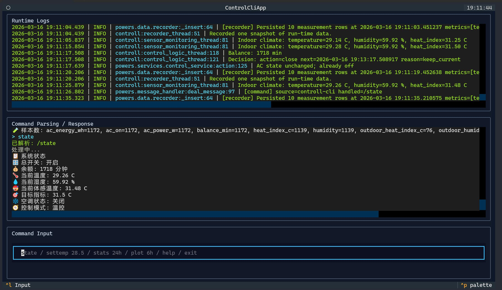
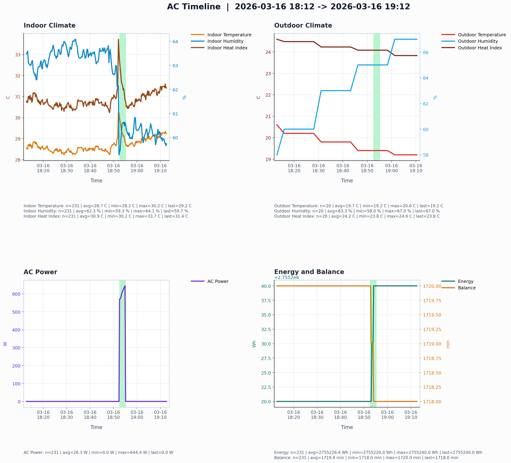
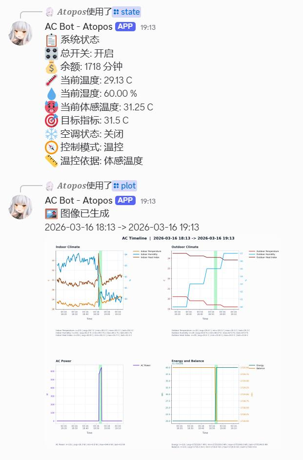

# HKUST AC Remaster

HKUST AC Remaster 是一个面向 HKUST 宿舍空调的自动控制项目。它会登录学校预付费空调门户，读取本地温湿度传感器，执行温控或定时控制逻辑，记录历史数据，并通过 QQ / Discord / 本地 CLI 提供远程操作接口。

## 主要功能

- Microsoft SSO + TOTP 自动登录 HKUST 空调门户
- 通过串口桥接的 SHT4x 传感器读取室内温湿度
- 温控模式与定时模式两套控制策略
- 本地 SQLite 历史记录、统计分析与图像导出
- QQ bot、Discord bot、本地 Textual 控制台

## 功能截图


### `controll_cli.py` 交互界面



### `analyse.py` 图像分析结果



### Bot 指令效果



## 项目结构

```text
controll.py         主程序入口，启动控制线程与 bot
controll_cli.py     本地 Textual 交互控制台
analyse.py          数据分析 CLI / shell
powers/
  auth/
    auth.py         HKUST 登录流程（Microsoft 账号密码 + TOTP）
    ac_api.py       预付费空调 API 客户端
  data/
    global_state.py 进程内状态
    settings.py     JSON 持久化设置
    recorder.py     SQLite 数据记录
    analysis.py     统计和图像导出
  io/
    thermometer.py  室内传感器抽象接口
    sht4x_serial_sensor.py SHT4x 串口桥实现
  services/
    control_service.py 控制决策逻辑
  qq_bot.py         QQ 机器人
  discord_bot.py    Discord 机器人
  utils/
    config.py       配置与凭据加载
    logger.py       日志配置
docs/
  setup.zh-CN.md    中文配置教程
  setup.en.md       English setup guide
```

## 环境要求

- Python 3.10+
- Windows 环境或至少能访问对应串口设备
- 可访问 HKUST 空调门户的网络环境
- 可用的 Microsoft MFA 验证器
- 可选：QQ bot 与 Discord bot 开发者账号

## 安装

```bash
pip install -r requirements.txt
playwright install chromium
```

## 凭据配置

程序会按顺序查找以下文件：

- `creds.json`
- `creds/credentials.json`

建议从示例文件开始：

```bash
copy creds\credentials.example.json creds\credentials.json
```

示例结构如下：

```json
{
  "email": "yourname@connect.ust.hk",
  "password": "your_password_here",
  "microsoft_secret": "BASE32_SECRET_FROM_MICROSOFT_AUTHENTICATOR",
  "qq_app_id": "your_qq_app_id",
  "qq_secret": "your_qq_secret",
  "discord_token": "your_discord_bot_token",
  "command_language": "zh"
}
```

其中：

- `microsoft_secret` 是 Microsoft Authenticator 的手动密钥
- `qq_app_id` / `qq_secret` 来自 QQ 开放平台机器人应用
- `discord_token` 来自 Discord Developer Portal
- `command_language` 可设为 `zh`、`en` 或 `bilingual`

## 运行

主程序：

```bash
python controll.py
```

本地控制台：

```bash
python controll_cli.py
```

分析 shell：

```bash
python analyse.py
```

可见浏览器调试模式：

```bash
debug.bat
```

## Bot 接入开关

`controll.py` 顶部提供了两个直接开关：

```python
ENABLE_QQ_BOT = True
ENABLE_DISCORD_BOT = True
```

你可以按需要修改为：

- 两个都开：同时接入 QQ 和 Discord
- 只开 QQ：`ENABLE_QQ_BOT = True`，`ENABLE_DISCORD_BOT = False`
- 只开 Discord：`ENABLE_QQ_BOT = False`，`ENABLE_DISCORD_BOT = True`
- 两个都关：只保留本地控制、记录与分析能力

这对于调试认证、控制逻辑、或单独联调某一个 bot 很有用。

## 当前温度读取逻辑

当前项目里的温湿度读取逻辑是基于我自己的设备实现的，不是通用商业化驱动。

现在的默认实现路径是：

- 抽象接口：`powers/io/thermometer.py`
- 当前设备实现：`powers/io/sht4x_serial_sensor.py`

这里采用了一个抽象基类 `Thermometer`，核心接口包括：

- `connect()`
- `get_climate()`
- `get_device_info()`

默认入口 `get_thermometer()` 当前会实例化 `SHT4xSerialThermometer(port=SERIAL_PORT)`，并通过 `get_climate()` 返回 `IndoorClimateReading(temperature, humidity)`。

### 你可以怎么适配自己的设备

有三种典型方式：

1. 购买或自制兼容的传感器，按现有 `Thermometer` 抽象写一个新的模块实现。
2. 直接修改 `powers/io/thermometer.py` 里的入口，把 `get_thermometer()` 指向你自己的实现。
3. 如果暂时没有温湿度传感器，可以写一个占位模块，始终返回固定温度和湿度，只使用 scheduler 模式。

### 推荐的扩展方式

你可以新增类似下面的模块：

```python
from powers.io.thermometer import IndoorClimateReading, Thermometer


class DummyThermometer(Thermometer):
    def connect(self) -> None:
        pass

    def get_climate(self) -> IndoorClimateReading:
        return IndoorClimateReading(temperature=27.0, humidity=60.0)

    def get_device_info(self) -> dict:
        return {"driver": "dummy"}
```

然后把 `powers/io/thermometer.py` 中的入口切到这个实现。这样项目的其余部分无需改动。

### 没有传感器时的建议

如果你只想把项目当作一个“定时开关空调”的自动化器来使用：

- 可以接入一个占位温湿度模块
- 在配置中把模式切到 `scheduler`
- 不依赖真实温度反馈

这样仍然可以使用：

- 自动登录与空调控制
- bot 命令
- 日志记录
- 电参 / 余额 / 户外天气记录

## 工作策略

当前系统的主循环由 `controll.py` 启动，主要包括：

- 室内传感器线程
- 控制逻辑线程
- 室内/电参数据记录线程
- 室外天气记录线程
- QQ bot
- Discord bot

控制逻辑核心在 `powers/services/control_service.py`。

### 温控模式

温控模式会读取当前设置中的：

- `target_temp`
- `temperature_control_basis`
- `temp_threshold_high`
- `temp_threshold_low`
- `cooldown_time`

其中 `temperature_control_basis` 可以选择：

- `temperature`
- `heat_index`

也就是说，系统既可以按实际温度控制，也可以按体感温度控制。

温控模式的行为是：

- 当空调关闭且当前值高于 `target_temp + temp_threshold_high` 时，系统请求开机
- 当空调开启且当前值低于 `target_temp - temp_threshold_low` 时，系统请求关机
- 其余情况下维持当前状态

这是一种带滞回的控制，目的是避免在目标点附近反复抖动。

### 冷静期 / 冷却时间

`cooldown_time` 是温控模式的重要参数。

它表示两次状态切换之间的最短等待时间。在冷静期内，即使温度越过阈值，控制器也不会立刻再次切换，而是继续保持当前状态，直到冷静期结束。

它的作用主要是：

- 防止频繁开关机
- 降低短周期抖动
- 让房间和设备有足够时间体现上一次动作的效果

### 定时模式

定时模式完全不依赖实时温湿度反馈，而是使用：

- `ontime`
- `offtime`

控制器会根据当前状态和 `last_switch`：

- 若当前已开机，达到 `ontime` 后关机
- 若当前已关机，达到 `offtime` 后开机

这适合以下场景：

- 你没有可靠的温湿度传感器
- 房间热惯性比较稳定
- 你已经摸索出适合自己的开关周期

### 临时锁定

系统支持一个临时锁定机制：

- `lock_status`
- `lock_end_time`

如果锁定仍然有效，控制逻辑会优先服从锁定状态，而不是正常温控/定时策略。

这适合：

- 睡前强制开一段时间
- 短时间内强制关闭
- 临时压过自动策略

### 定时关闭防止偷跑

当控制器决定执行开机动作时，`ControlService.action()` 会额外同步设置空调的 off-timer。

也就是说，系统不仅在本地记住“下一次应该何时关机”，还会把这个时间写进空调设备侧定时器。这样即使程序异常退出、线程卡住、或网络状态变化，设备端仍然保留一个关机保护时间，用来降低“偷跑”风险。

### 余额与主开关保护

在每个控制周期里，`controll.py` 还会先检查：

- 总开关 `switch`
- 余额 `balance`

如果：

- 主开关关闭，则跳过控制
- 余额不足，则跳过控制

这保证控制器不会在明显不应动作的状态下继续尝试操作空调。

## 各入口脚本说明

### `controll.py`

这是主运行入口，负责：

- 启动所有后台线程
- 初始化 QQ / Discord bot
- 周期性读取传感器
- 执行控制决策
- 写入历史数据库
- 处理优雅退出

如果你想真正让系统持续运行，这是最主要的入口。

### `controll_cli.py`

这是一个基于 Textual 的本地交互控制台，适合：

- 在本机直接查看 runtime log
- 输入命令并立即获得响应
- 不依赖 QQ / Discord 测试命令处理器
- 调试控制逻辑、bot command、数据分析指令

它和 bot 共用同一套 `BotMessageHandler`，因此本地 CLI 可以看作是 bot 指令系统的“直连调试界面”。

### `analyse.py`

这是历史数据分析入口，支持：

- 列出已有 metric
- 生成区间摘要
- 生成 AI prompt
- 导出图像
- 进入交互 shell

它适合做这些事：

- 回看过去几小时/几天的运行效果
- 统计空调运行时长、功率、余额变化
- 对比室内外温湿度与体感温度
- 导出图发给别人看
- 为后续调参生成分析上下文

## 控制接口

QQ / Discord / CLI 共用同一套命令处理器，常用命令包括：

- `/state`
- `/scheduler`
- `/timer`
- `/lock`
- `/log`
- `/stats 24h`
- `/plot 6h`
- `/settemp 28.5`
- `/setbasis temperature|heatindex`
- `/settime 300 1200`
- `/setmode temperature|scheduler`
- `/switchOn`
- `/switchOff`

## 数据与输出

- `data/settings.json`：运行时设置
- `data/ac_history.sqlite`：历史记录数据库
- `figure/`：导出的分析图
- `log/`：运行日志与告警日志

## 安全说明

- `creds.json`、`creds/credentials.json`、`creds/` 下其他真实凭据文件都不应提交到 Git。
- `data/`、`log/`、`figure/` 都是运行产物，默认已加入 `.gitignore`。
- QQ bot 与 Discord bot 的权限建议先从最小权限开始，只开放当前项目确实需要的事件和可见范围。

## 相关文档

- 中文配置教程：[docs/setup.zh-CN.md](docs/setup.zh-CN.md)
- English setup guide: [docs/setup.en.md](docs/setup.en.md)
